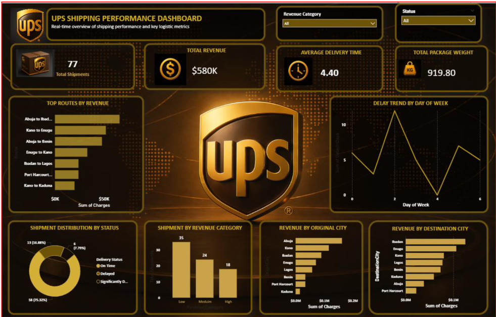

# UPS Shipping Performance Dashboard

## Overview
Analysed a UPS logistics dataset covering 77 shipments across multiple 
Nigerian cities to uncover delivery patterns, revenue trends, and 
operational inefficiencies.

## Tools Used
- Microsoft Excel (data cleaning)
- Power BI (dashboard & visualisation)

## Key Metrics
- Total Shipments: 77
- Total Revenue: $580K
- Average Delivery Time: 4.40 days
- On-Time Delivery Rate: 75.32%

## Key Findings
- Mid-week delays peak on Day 2 and Day 4 — pointing to scheduling issues
- Abuja–Ibadan and Kano–Enugu are the highest revenue routes
- A few routes generate most of the revenue, creating dependency risk
- Most shipments fall in the low-to-medium revenue category

## Recommendations
- Optimise high-revenue routes for better profitability
- Improve mid-week scheduling and resource allocation
- Focus on growing high-value shipment categories
- Monitor shipment performance regularly

## Dashboard Preview

